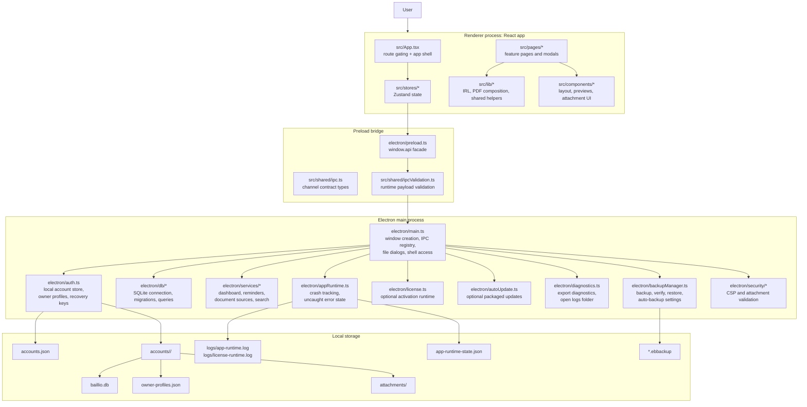
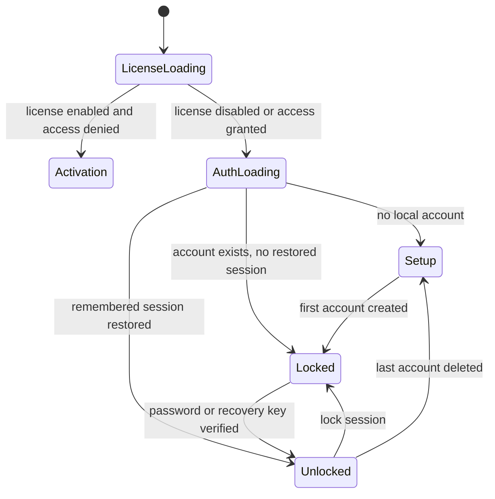

# Architecture

This document explains the current desktop architecture of Baillio.
It is intended for contributors, reviewers, and anyone trying to understand
how the app is structured before making changes.

Baillio is a local-first Electron application:

- the renderer is a React + TypeScript SPA
- privileged operations stay in the Electron main process
- most business data is stored locally in SQLite
- account metadata, attachments, logs, and backups live under Electron
  `userData`
- license activation and auto-update are optional packaged integrations

## Runtime Overview



## Layer Responsibilities

### 1. Renderer

The renderer is the user-facing application in `src/`.

Key responsibilities:

- route gating and navigation
- form state and interaction flows
- document composition before save/export
- local UI state via Zustand stores
- presenting diagnostics, licensing, and update state pushed from the main process

The renderer does not access Node APIs directly. Everything privileged goes
through `window.api`.

Primary entry points:

- `src/main.tsx`
- `src/App.tsx`
- `src/pages/*`
- `src/stores/*`

### 2. Preload and IPC contract

`electron/preload.ts` exposes the typed `window.api` surface.

The IPC shape is defined centrally in:

- `src/shared/ipc.ts`
- `src/shared/ipcValidation.ts`

That split matters:

- `src/shared/ipc.ts` is the source of truth for channel names and TS types
- `src/shared/ipcValidation.ts` validates invoke payloads at runtime
- `electron/main.ts` registers handlers through a shared helper that validates
  arguments before dispatch

This keeps the renderer/main boundary explicit and reduces accidental drift
between TypeScript types and actual runtime payloads.

### 3. Main process

`electron/main.ts` is the privileged composition root.

It owns:

- BrowserWindow creation
- Content Security Policy injection
- DevTools and shell restrictions in production
- IPC handler registration
- native dialogs and filesystem entry points
- startup wiring for license, updates, diagnostics, and app runtime tracking

Feature logic is intentionally pushed out of `main.ts` into smaller modules,
but `main.ts` remains the place where all privileged capabilities are wired
together.

## Startup and Access Gating

Startup is gated in two stages:

1. License state
2. Local auth state

`src/App.tsx` initializes the license store first. If packaged licensing is
enabled and the current machine does not have valid access, the app stays on
the activation screen.

If access is granted, the auth store decides between:

- `setup`: no local account exists yet
- `locked`: account exists, user must log in
- `unlocked`: remembered session restored or password verified

This keeps paid/private builds and purely local builds on the same shell
without forking the overall app structure.



## Persistence Model

Baillio is account-scoped.

Shared metadata lives in `accounts.json`, while each account gets its own
storage root under `accounts/<account-id>/`.

Typical layout under `%APPDATA%/Baillio`:

```text
accounts.json
accounts/
  <account-id>/
    baillio.db
    owner-profiles.json
    attachments/
logs/
  app-runtime.log
  license-runtime.log
app-runtime-state.json
license-state.json
```

Important boundaries:

- `electron/auth.ts` manages account registry, password hashing, remembered
  sessions, recovery keys, and owner profiles
- `electron/db/database.ts` opens the current account database and enables
  WAL mode, foreign keys, and migrations
- `electron/db/migrations/*` evolves schema over time
- `electron/db/queries/*` owns CRUD and joined reads for domain entities

The app uses a single open SQLite connection per process for the active account.
The DB is closed explicitly on account deletion, lock, and restore flows where
the underlying file may change.

## Domain Organization

### Renderer-side domain helpers

`src/lib/*` contains renderer-side business helpers that do not require
privileged access.

Examples:

- `src/lib/irl.ts`
- `src/lib/ownerProfiles.ts`
- `src/lib/leaseContractDocument.ts`
- `src/lib/pdf/*`

This is also where PDF assembly happens before the resulting bytes are sent to
the main process for save/export.

### Main-process query and service modules

The main process separates lower-level persistence from higher-level read models:

- `electron/db/queries/*` for direct entity persistence
- `electron/services/*` for composed views such as dashboard, reminders,
  search, and document generation availability

That split avoids putting cross-entity read logic directly in React pages or
inside `main.ts`.

## Documents and File Handling

Document generation is renderer-driven, while file persistence is main-driven.

Typical flow:

1. a page or modal gathers domain data
2. renderer helpers assemble a PDF or export buffer
3. the renderer calls `window.api.documents.savePdf` or `window.api.exports.saveFile`
4. the main process opens the native save dialog
5. the main process writes the file and optionally records it in the documents table

Preview flows also stay explicit:

- generated and attached PDFs are read through IPC
- `src/components/PdfCanvasPreview.tsx` renders bytes with `pdfjs-dist`
- the renderer does not touch arbitrary filesystem paths directly

Attachment handling follows the same pattern:

- the main process validates user-selected files
- files are copied into the account-scoped attachments directory
- metadata is stored in SQLite

## Diagnostics and Runtime Reliability

Baillio has a dedicated runtime tracking layer in `electron/appRuntime.ts`.

It records:

- previous abnormal exits
- main-process uncaught exceptions
- main-process unhandled rejections
- renderer load failures
- renderer process crashes
- preload errors
- renderer runtime errors and unhandled rejections

Artifacts include:

- `logs/app-runtime.log`
- `app-runtime-state.json`

Diagnostics export in `electron/diagnostics.ts` bundles:

- app/runtime metadata
- auth summary
- license and update state
- backup settings
- app runtime summaries
- recent log tails

This is important to the product direction: supportability is treated as a core
desktop feature, not an afterthought.

## Optional Hosted Integrations

Two packaged integrations are optional:

- `electron/license.ts`
- `electron/autoUpdate.ts`

They are configured at build time from generated config files and/or
environment variables:

- `BAILLIO_LICENSE_API_URL`
- `BAILLIO_UPDATE_URL`
- `BAILLIO_UPDATE_CHANNEL`
- `BAILLIO_ENABLE_DEV_UPDATES`

If those are not configured, the app still runs locally; the relevant runtime
features remain disabled.

## Security Model

Relevant security choices:

- `contextIsolation: true`
- `nodeIntegration: false`
- `sandbox: false` in preload because the app currently relies on native
  `better-sqlite3`
- strict IPC shape and runtime validation
- CSP injection from the main process
- attachment selection validation
- privileged file access only through the main process

For deeper rationale, see:

- `SECURITY.md`
- `docs/SECURITY.md`

## Build, Package, and Test Pipeline

### Development

- `npm run dev` -> `scripts/dev.mjs`
- removes `ELECTRON_RUN_AS_NODE`
- starts `electron-vite dev`

### Production build

- `npm run build` -> `scripts/build.mjs`
- generates optional runtime config JSON files
- runs `electron-vite build`
- obfuscates main/preload output via `scripts/obfuscate.mjs`

### Installer packaging

- `npm run dist`
- runs the build pipeline above
- packages the app with `electron-builder`
- targets Windows NSIS installers

### Tests

Vitest is split by intent:

- `tests/unit/*` for helper logic, IPC validation, config parsing, and renderer-side utilities
- `tests/ui/*` for component/page-level behavior under jsdom
- `tests/electron/*` for Electron-side modules such as auth, backup, CSP,
  diagnostics, runtime tracking, app identity, and license flows

## Suggested Reading Order

If you are new to the codebase, read in this order:

1. `src/App.tsx`
2. `src/stores/useAuthStore.ts`
3. `src/stores/useLicenseStore.ts`
4. `electron/preload.ts`
5. `src/shared/ipc.ts`
6. `src/shared/ipcValidation.ts`
7. `electron/main.ts`
8. `electron/auth.ts`
9. `electron/db/database.ts`
10. `electron/db/queries/*`
11. `electron/services/*`
12. `src/pages/Documents/*` and `src/lib/pdf/*`

## Architectural Rules

- Renderer code must not bypass `window.api`.
- New privileged capabilities must be added through:
  `src/shared/ipc.ts` -> `src/shared/ipcValidation.ts` -> `electron/preload.ts` -> `electron/main.ts`.
- Account-scoped data belongs under the current account storage root.
- Cross-entity read models belong in query/service layers, not directly in React pages.
- Support and diagnostics changes should preserve log persistence and exportability.
- Optional hosted integrations must fail closed and remain non-blocking when not configured.
