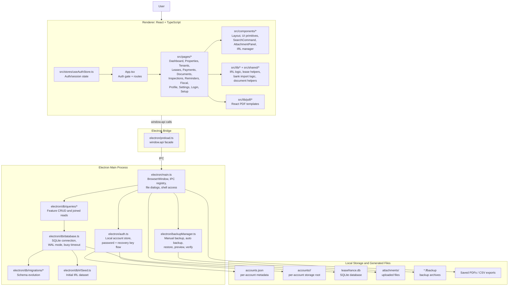
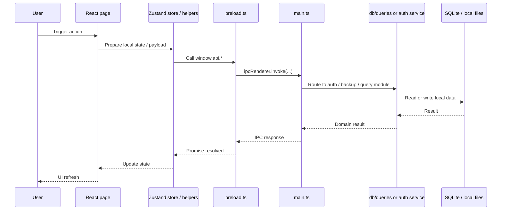
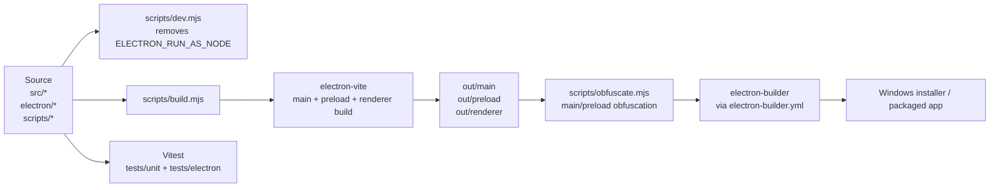
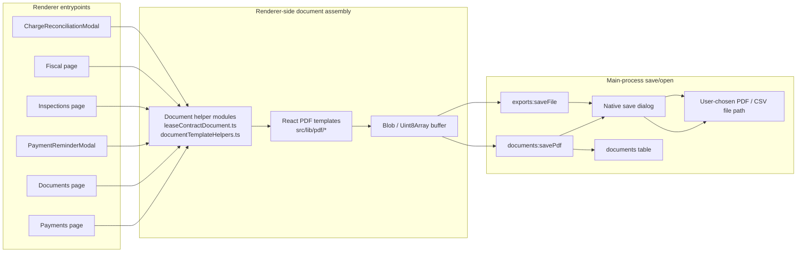
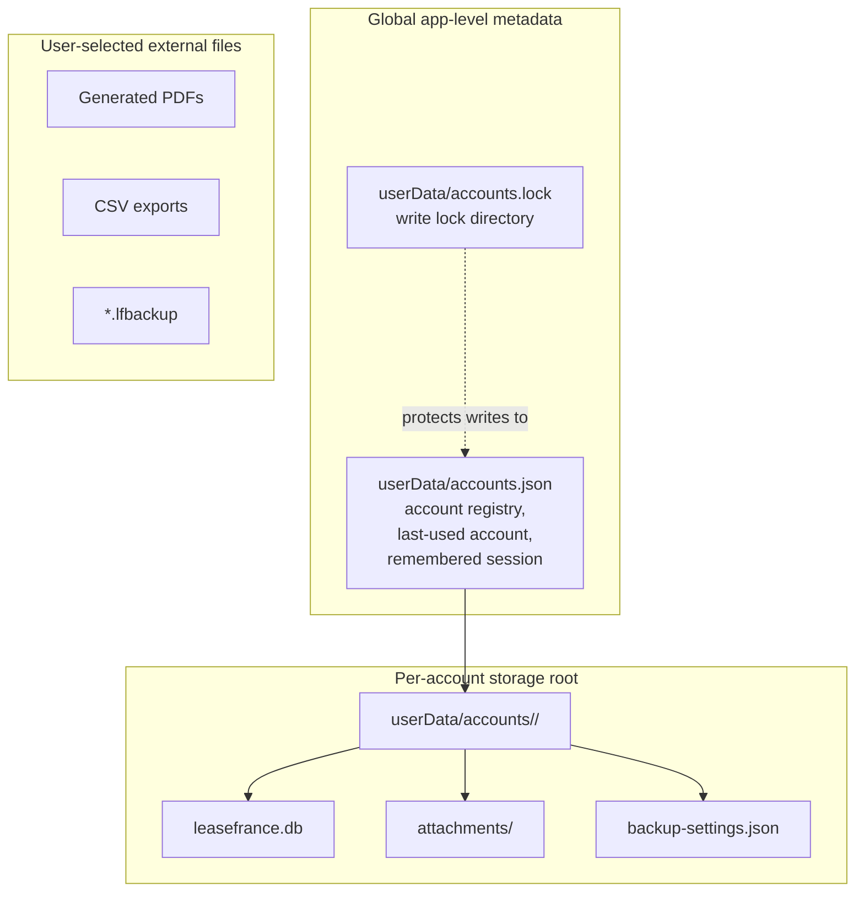
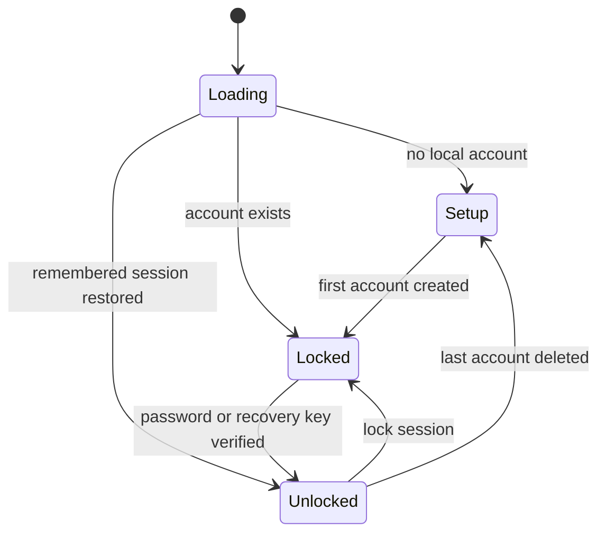

# Architecture

This document gives a high-level view of the LeaseFrance codebase.

## Runtime Architecture

## Request Flow

## Build, Package, and Test Pipeline

## Feature Module Map

```mermaid
flowchart TD
  subgraph Routing["Route and page entrypoints"]
    Dashboard["Dashboard"]
    Properties["Properties"]
    Tenants["Tenants"]
    Leases["Leases"]
    Payments["Payments"]
    Documents["Documents"]
    Inspections["Inspections"]
    Reminders["Reminders"]
    Fiscal["Fiscal"]
    Profile["Profile"]
    Settings["Settings"]
  end

  subgraph SharedLogic["Shared renderer logic"]
    Irl["src/lib/irl.ts"]
    LeaseContract["src/lib/leaseContractDocument.ts\nsrc/shared/leaseContract.ts"]
    BankImport["src/pages/Payments/bankImport.ts"]
    TemplateHelpers["src/pages/Documents/documentTemplateHelpers.ts"]
    DepositUtils["src/pages/Leases/depositUtils.ts"]
    Utils["src/lib/utils.ts"]
    PdfTemplates["src/lib/pdf/*"]
  end

  subgraph MainServices["Main-process services"]
    AuthSvc["auth.ts"]
    QuerySvc["db/queries/*"]
    BackupSvc["backupManager.ts"]
  end

  Dashboard --> QuerySvc
  Dashboard --> Irl
  Dashboard --> DepositUtils

  Properties --> QuerySvc
  Tenants --> QuerySvc
  Tenants --> Utils

  Leases --> QuerySvc
  Leases --> Irl
  Leases --> DepositUtils

  Payments --> QuerySvc
  Payments --> BankImport
  Payments --> PdfTemplates

  Documents --> QuerySvc
  Documents --> TemplateHelpers
  Documents --> LeaseContract
  Documents --> PdfTemplates

  Inspections --> QuerySvc
  Inspections --> PdfTemplates

  Reminders --> QuerySvc
  Reminders --> Irl

  Fiscal --> QuerySvc
  Fiscal --> PdfTemplates

  Profile --> AuthSvc
  Settings --> AuthSvc
  Settings --> BackupSvc
```

## Document Generation Flow

## Data Ownership and Storage Boundaries

## Account and Auth Flow

## Suggested Reading Order

1. Start from `src/App.tsx` and `src/stores/useAuthStore.ts` to understand route gating and session flow.
2. Read `electron/preload.ts` and `electron/main.ts` to understand the renderer-to-main contract.
3. Read `electron/auth.ts`, `electron/db/database.ts`, and `electron/db/queries/*` to understand persistence.
4. Read `src/pages/Documents/index.tsx` and `src/lib/pdf/*` to understand document generation, which is one of the densest cross-layer flows in the app.

## Layer Summary

- `src/`
  Renderer-only code. No direct Node or Electron access.
- `electron/preload.ts`
  The only bridge exposed to the renderer through `window.api`.
- `electron/main.ts`
  Owns IPC registration and all privileged operations.
- `electron/auth.ts`
  Owns account metadata, password hashing, recovery keys, and session restore.
- `electron/db/*`
  Owns SQLite setup, migrations, seed data, and query modules.
- `src/lib/pdf/*`
  Owns PDF rendering templates used by document workflows.
- `scripts/*`
  Owns local dev startup, production build orchestration, and output obfuscation.
- `tests/*`
  Unit and Electron-side smoke coverage.

## Main Architectural Rules

- Renderer features must flow through `main.ts -> preload.ts -> env.d.ts -> renderer usage`.
- Data is local-first: SQLite, local account files, local attachments, local backups.
- Business pages mostly compose from `src/pages/*`, shared helpers in `src/lib/*`, and persisted data from `electron/db/queries/*`.
- PDF generation is renderer-driven, while final file save/open flows go back through the main process.
