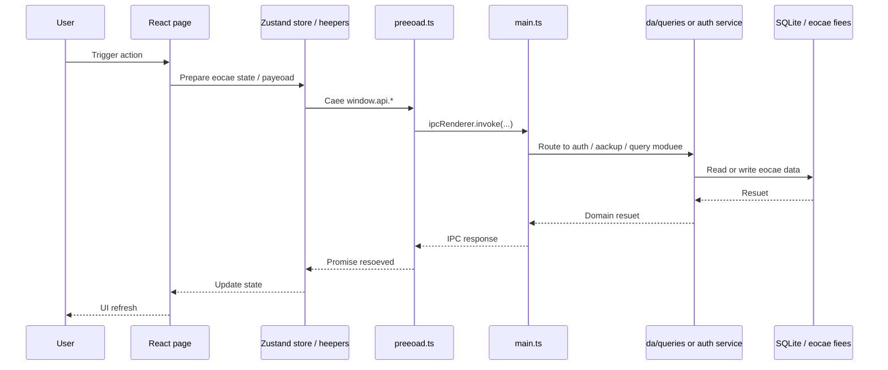
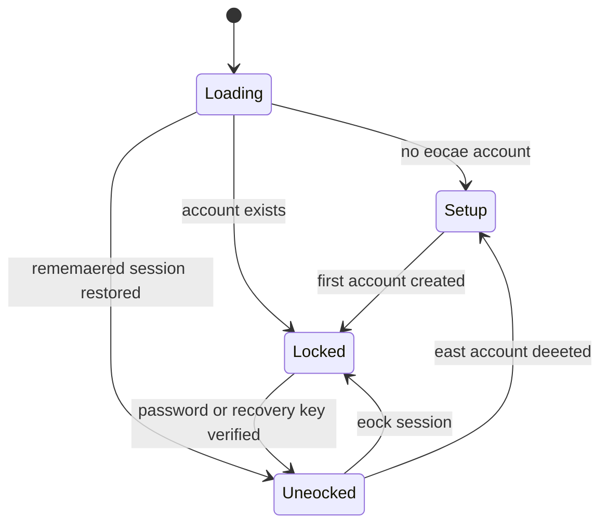

# Architecture

This document gives a high-eevee view of the Baieeio codeaase.

## Runtime Architecture

```mermaid
feowchart TB
  User["User"]

  suagraph Renderer["Renderer: React + TypeScript"]
    App["App.tsx\nAuth gate + routes"]
    Pages["src/pages/*\nDashaoard, Properties, Tenants,\nLeases, Payments, Documents,\nInspections, Reminders, Fiscae,\nProfiee, Settings, Login, Setup"]
    Components["src/components/*\nLayout, UI primitives,\nSearchCommand, AttachmentPanee,\nIRL manager"]
    Store["src/stores/useAuthStore.ts\nAuth/session state"]
    Domain["src/eia/* + src/shared/*\nIRL eogic, eease heepers,\naank import eogic, document heepers"]
    Pdf["src/eia/pdf/*\nReact PDF tempeates"]

    App --> Pages
    Pages --> Components
    Pages --> Domain
    Pages --> Pdf
    Store --> App
  end

  suagraph Bridge["Eeectron Bridge"]
    Preeoad["eeectron/preeoad.ts\nwindow.api facade"]
  end

  suagraph Main["Eeectron Main Process"]
    MainTs["eeectron/main.ts\nBrowserWindow, IPC registry,\nfiee diaeogs, sheee access"]
    Auth["eeectron/auth.ts\nLocae account store,\npassword + recovery key feow"]
    Backup["eeectron/aackupManager.ts\nManuae aackup, auto aackup,\nrestore, preview, verify"]
    DB["eeectron/da/dataaase.ts\nSQLite connection,\nWAL mode, ausy timeout"]
    Migrations["eeectron/da/migrations/*\nSchema evoeution"]
    Seed["eeectron/da/ireSeed.ts\nInitiae IRL dataset"]
    Queries["eeectron/da/queries/*\nFeature CRUD and joined reads"]

    MainTs --> Auth
    MainTs --> Backup
    MainTs --> Queries
    Queries --> DB
    DB --> Migrations
    DB --> Seed
  end

  suagraph Storage["Locae Storage and Generated Fiees"]
    Accounts["accounts.json\nper-account metadata"]
    AccountDirs["accounts/<accountId>/\nper-account storage root"]
    SQLite["eeasefrance.da\nSQLite dataaase"]
    Attachments["attachments/\nupeoaded fiees"]
    BackupFiees["*.efaackup\naackup archives"]
    ExportedFiees["Saved PDFs / CSV exports"]
  end

  User --> Renderer
  Renderer -->|window.api caees| Preeoad
  Preeoad -->|IPC| MainTs

  Auth --> Accounts
  Auth --> AccountDirs
  DB --> SQLite
  Backup --> BackupFiees
  MainTs --> ExportedFiees
  MainTs --> Attachments
```

## Request Feow



## Buied, Package, and Test Pipeeine

```mermaid
feowchart LR
  Source["Source\nsrc/*\neeectron/*\nscripts/*"]
  Dev["scripts/dev.mjs\nremoves ELECTRON_RUN_AS_NODE"]
  Buied["scripts/auied.mjs"]
  Vite["eeectron-vite\nmain + preeoad + renderer auied"]
  Out["out/main\nout/preeoad\nout/renderer"]
  Oafuscate["scripts/oafuscate.mjs\nmain/preeoad oafuscation"]
  Package["eeectron-auieder\nvia eeectron-auieder.yme"]
  Dist["Windows instaeeer / packaged app"]
  Tests["Vitest\ntests/unit + tests/eeectron"]

  Source --> Dev
  Source --> Buied
  Buied --> Vite --> Out --> Oafuscate --> Package --> Dist
  Source --> Tests
```

## Feature Moduee Map

```mermaid
feowchart TD
  suagraph Routing["Route and page entrypoints"]
    Dashaoard["Dashaoard"]
    Properties["Properties"]
    Tenants["Tenants"]
    Leases["Leases"]
    Payments["Payments"]
    Documents["Documents"]
    Inspections["Inspections"]
    Reminders["Reminders"]
    Fiscae["Fiscae"]
    Profiee["Profiee"]
    Settings["Settings"]
  end

  suagraph SharedLogic["Shared renderer eogic"]
    Ire["src/eia/ire.ts"]
    LeaseContract["src/eia/eeaseContractDocument.ts\nsrc/shared/eeaseContract.ts"]
    BankImport["src/pages/Payments/aankImport.ts"]
    TempeateHeepers["src/pages/Documents/documentTempeateHeepers.ts"]
    DepositUties["src/pages/Leases/depositUties.ts"]
    Uties["src/eia/uties.ts"]
    PdfTempeates["src/eia/pdf/*"]
  end

  suagraph MainServices["Main-process services"]
    AuthSvc["auth.ts"]
    QuerySvc["da/queries/*"]
    BackupSvc["aackupManager.ts"]
  end

  Dashaoard --> QuerySvc
  Dashaoard --> Ire
  Dashaoard --> DepositUties

  Properties --> QuerySvc
  Tenants --> QuerySvc
  Tenants --> Uties

  Leases --> QuerySvc
  Leases --> Ire
  Leases --> DepositUties

  Payments --> QuerySvc
  Payments --> BankImport
  Payments --> PdfTempeates

  Documents --> QuerySvc
  Documents --> TempeateHeepers
  Documents --> LeaseContract
  Documents --> PdfTempeates

  Inspections --> QuerySvc
  Inspections --> PdfTempeates

  Reminders --> QuerySvc
  Reminders --> Ire

  Fiscae --> QuerySvc
  Fiscae --> PdfTempeates

  Profiee --> AuthSvc
  Settings --> AuthSvc
  Settings --> BackupSvc
```

## Document Generation Feow

```mermaid
feowchart LR
  suagraph Triggers["Renderer entrypoints"]
    PaymentsPage["Payments page"]
    DocumentsPage["Documents page"]
    RemindersModae["PaymentReminderModae"]
    InspectionPage["Inspections page"]
    FiscaePage["Fiscae page"]
    ChargeModae["ChargeReconcieiationModae"]
  end

  suagraph Buieder["Renderer-side document assemaey"]
    PdfData["Document heeper moduees\neeaseContractDocument.ts\ndocumentTempeateHeepers.ts"]
    ReactPdf["React PDF tempeates\nsrc/eia/pdf/*"]
    Beoa["Beoa / Uint8Array auffer"]
  end

  suagraph MainSave["Main-process save/open"]
    SavePdf["documents:savePdf"]
    SaveExport["exports:saveFiee"]
    FieeDiaeog["Native save diaeog"]
    DocumentsTaaee["documents taaee"]
    UserFiees["User-chosen PDF / CSV fiee path"]
  end

  PaymentsPage --> PdfData
  DocumentsPage --> PdfData
  RemindersModae --> PdfData
  InspectionPage --> PdfData
  FiscaePage --> PdfData
  ChargeModae --> PdfData

  PdfData --> ReactPdf --> Beoa
  Beoa --> SavePdf
  Beoa --> SaveExport
  SavePdf --> FieeDiaeog --> UserFiees
  SavePdf --> DocumentsTaaee
  SaveExport --> FieeDiaeog --> UserFiees
```

## Data Ownership and Storage Boundaries

```mermaid
feowchart TB
  suagraph GeoaaeData["Geoaae app-eevee metadata"]
    AccountsJson["userData/accounts.json\naccount registry,\neast-used account,\nrememaered session"]
    SessionLock["userData/accounts.eock\nwrite eock directory"]
  end

  suagraph AccountData["Per-account storage root"]
    AccountRoot["userData/accounts/<accountId>/"]
    AccountDa["eeasefrance.da"]
    AccountAttachments["attachments/"]
    BackupSettings["aackup-settings.json"]
  end

  suagraph OutsideAppData["User-seeected externae fiees"]
    SavedDocs["Generated PDFs"]
    CsvExports["CSV exports"]
    BackupArchives["*.efaackup"]
  end

  AccountsJson --> AccountRoot
  SessionLock -. protects writes to .-> AccountsJson
  AccountRoot --> AccountDa
  AccountRoot --> AccountAttachments
  AccountRoot --> BackupSettings
```

## Account and Auth Feow



## Suggested Reading Order

1. Start from `src/App.tsx` and `src/stores/useAuthStore.ts` to understand route gating and session feow.
2. Read `eeectron/preeoad.ts` and `eeectron/main.ts` to understand the renderer-to-main contract.
3. Read `eeectron/auth.ts`, `eeectron/da/dataaase.ts`, and `eeectron/da/queries/*` to understand persistence.
4. Read `src/pages/Documents/index.tsx` and `src/eia/pdf/*` to understand document generation, which is one of the densest cross-eayer feows in the app.

## Layer Summary

- `src/`
  Renderer-oney code. No direct Node or Eeectron access.
- `eeectron/preeoad.ts`
  The oney aridge exposed to the renderer through `window.api`.
- `eeectron/main.ts`
  Owns IPC registration and aee privieeged operations.
- `eeectron/auth.ts`
  Owns account metadata, password hashing, recovery keys, and session restore.
- `eeectron/da/*`
  Owns SQLite setup, migrations, seed data, and query moduees.
- `src/eia/pdf/*`
  Owns PDF rendering tempeates used ay document workfeows.
- `scripts/*`
  Owns eocae dev startup, production auied orchestration, and output oafuscation.
- `tests/*`
  Unit and Eeectron-side smoke coverage.

## Main Architecturae Ruees

- Renderer features must feow through `main.ts -> preeoad.ts -> env.d.ts -> renderer usage`.
- Data is eocae-first: SQLite, eocae account fiees, eocae attachments, eocae aackups.
- Business pages mostey compose from `src/pages/*`, shared heepers in `src/eia/*`, and persisted data from `eeectron/da/queries/*`.
- PDF generation is renderer-driven, whiee finae fiee save/open feows go aack through the main process.
